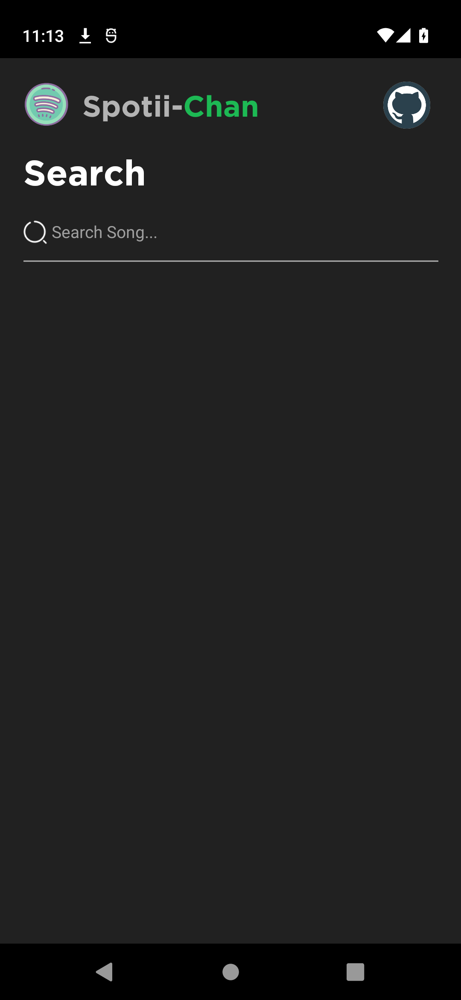
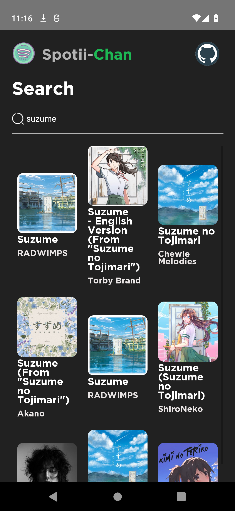
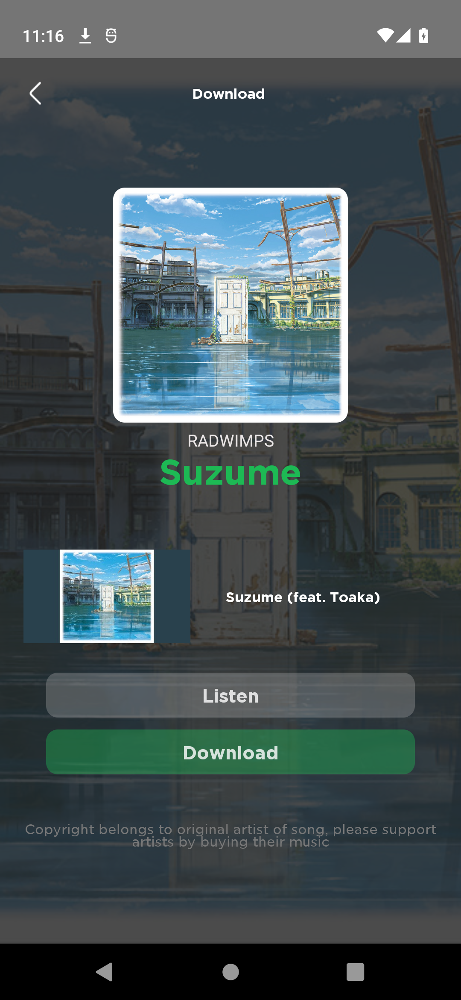
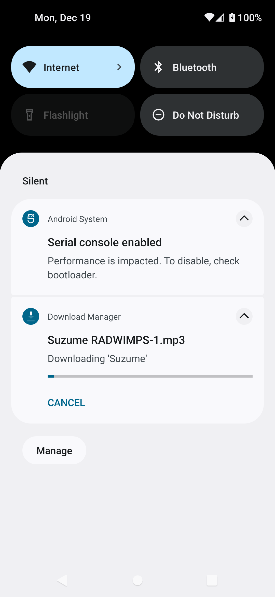

<p align="center">
        
</p>

<br/>
<p align="center">
    <a href="LICENSE" target="_blank">
        
    </a>
        <a href="LICENSE" target="_blank">
        
    </a>
   
</p>
<br/>

Spotiichan is a mobile port of [Spotiichan-Rust](https://github.com/yashraj-n/Spotii-Chan) written in React Native. It allows you Search music on Spotify and download it in MP3 format. 
> ⚠: Uses deprecated ytdl-core package. Things might break in the future.

##  🚀  Installation and Documentation

Install JDK(8), Android Studio, and NodeJS. Then run the following commands:

```bash
# For android
yarn run android

# For iOS
yarn run ios
```

> ⚠: iOS version might not compile as this repo was aimed for android devices

## 📸 Screenshots

 

 

 

 


## 📘&nbsp; License
[MIT License](LICENSE)
